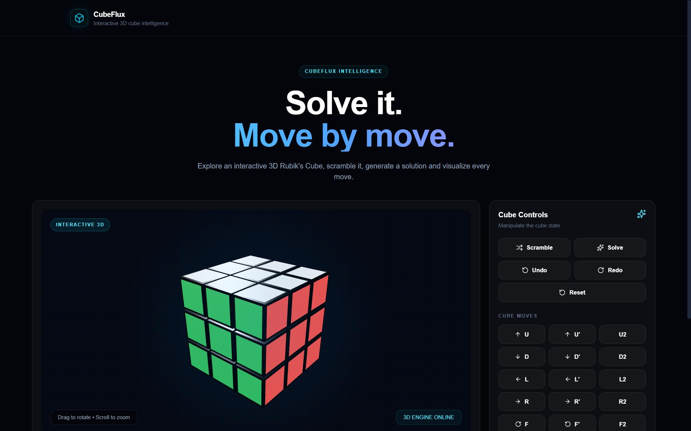
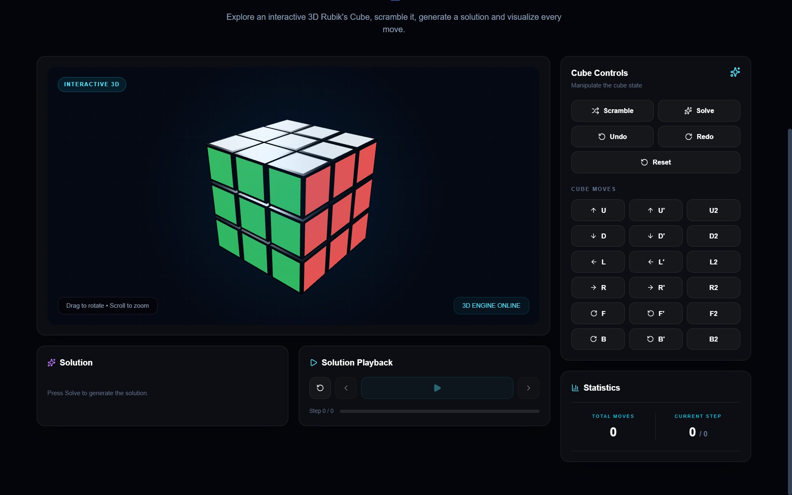
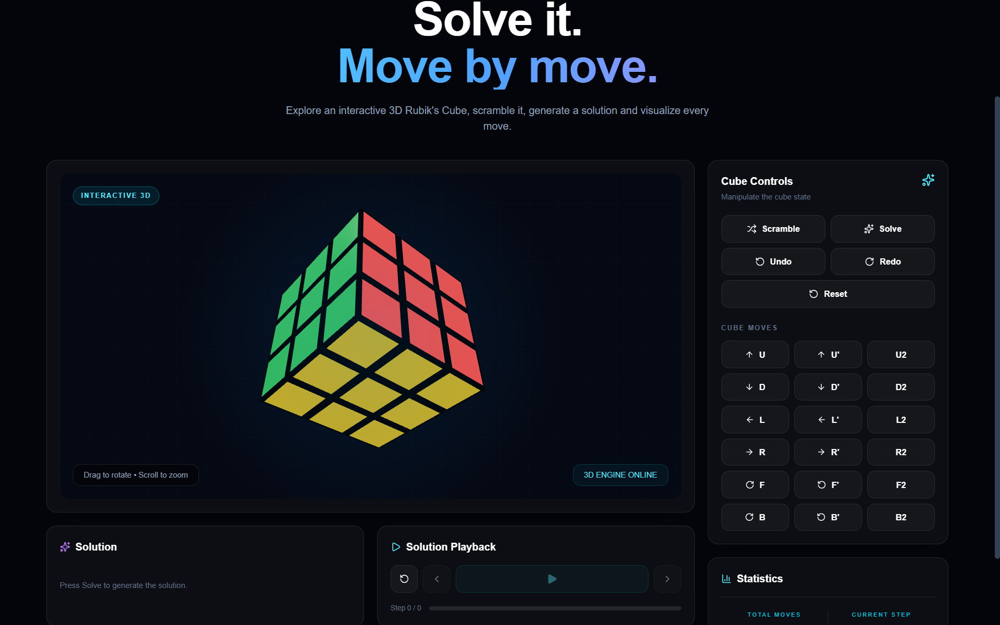

# Rubixq

A futuristic 3D Rubik's Cube solver built with Next.js, Three.js and React Three Fiber. Rubixq combines an interactive 3D cube, physical move animations and step-by-step solution playback in a responsive UI.

## Overview


---

---

---

## Features

- Interactive 3×3 Rubik's Cube with camera rotation and zoom
- Physical layer animations for `U D L R F B`, `'` and `2` moves
- Scramble, reset, undo/redo and move history
- Solution generation with step-by-step playback
- Responsive futuristic UI

## Tech Stack

- Next.js
- TypeScript
- React Three Fiber & Three.js
- Tailwind CSS
- Framer Motion
- Zustand
- Lucide React

## Getting Started

### Prerequisites

- Node.js 18+
- npm

### Installation

```bash
git clone https://github.com/samoff04/Rubixq.git
cd Rubixq
npm install
npm run dev
```

## Project Structure
```
Rubixq/
├── src/
│   ├── app/
│   ├── components/
│   ├── lib/
│   ├── store/
│   └── types/
├── docs/
├── public/
├── .gitignore
├── package.json
├── package-lock.json
├── next.config.js
├── postcss.config.mjs
├── tsconfig.json
└── README.md
```

## Author

Samarth Varshney